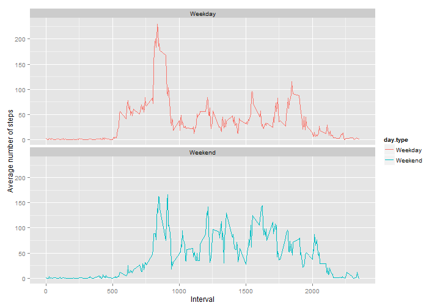

----------------------------------------------
title: "Reproducible Reasearch - Assignment 1"
author: "Rumy"
date: "July 18, 2015"
output: html_document
keep_md: true
----------------------------------------------

### Purpose:

This R Markdown document describes basic analysis on data collected from wearable technolgies like FitBit, Jawbone etc.The purpose is to get familiar with creating R markdown files and publishing research output using knitr package.

-------------------------------------
### Load R packages used for Analysis
-------------------------------------

```r
library("ggplot2")
library("knitr")
suppressPackageStartupMessages(library("dplyr"))
```

-----------------------------------
### Set Global options for chunks
-----------------------------------

```r
knitr::opts_chunk$set(echo = TRUE, cache = TRUE)
```


### Get [Activity Monitoring Data](https://d396qusza40orc.cloudfront.net/repdata%2Fdata%2Factivity.zip) and save locally


```r
url <- "http://d396qusza40orc.cloudfront.net/repdata%2Fdata%2Factivity.zip"
download.file(url, destfile = "./repdata_data_activity.zip", mode = "wb")
unzip("./repdata_data_activity.zip")
activity.data <- read.csv("activity.csv", header = TRUE, sep = ",")
```

#### Save the date variable in activity data as 'DATE'

```r
activity.data$date <- as.Date(activity.data$date, format = "%Y-%m-%d" )
```


### Part 1: Calculate Mean no. of steps and plot histogram

#### a. Summary data frame with no. of steps per day


```r
steps.summary <- activity.data %>% filter(!is.na(steps)) %>% group_by(date) %>% summarize(total.steps = sum(steps)) %>% print
```

```
## Source: local data frame [53 x 2]
## 
##          date total.steps
## 1  2012-10-02         126
## 2  2012-10-03       11352
## 3  2012-10-04       12116
## 4  2012-10-05       13294
## 5  2012-10-06       15420
## 6  2012-10-07       11015
## 7  2012-10-09       12811
## 8  2012-10-10        9900
## 9  2012-10-11       10304
## 10 2012-10-12       17382
## ..        ...         ...
```

#### b. Create histogram of steps taken per day


```r
hist(steps.summary$total.steps, breaks = 20, main = "Total steps taken per day", ylab = "Frequency - No. of days", xlab = "Number of steps", col = "red")
```

 

#### c. Mean and median of steps per day

```r
mean.steps <- as.character(round(mean(steps.summary$total.steps, digit = 0)))
median.steps <- median(steps.summary$total.steps)
```

*Result --> The mean steps per day is 10766 and median steps per day is 10765*

###### *Note - Mean steps was converted to character to adjust the display format from scientific notation to normal*


### Part 2: Calculate Average daily pattern and plot time series

#### a. Time series plot of 5 minute interval


```r
    avg.activity <- activity.data %>% filter(!is.na(steps)) %>% group_by(interval) %>% summarize(avg.steps = mean(steps))
    plot.ts(x = avg.activity$interval, y = avg.activity$avg.steps, type = "l", 
        main = "Average steps by Interval for the day", xlab = "Interval",
        ylab = "Average Steps", col = "blue", xaxt = "n")
    axis(1, at = seq(100, 2400, by = 200), las = 2)
```

 

#### b. Calculate with maximum number of steps


```r
    max.steps <- subset(avg.activity, avg.steps == max(avg.activity$avg.steps))
    max.steps$avg.steps = round(max.steps$avg.steps, digits = 0)
```
*Result --> Interval 835 has maximum steps averaging at 206*
     

### Part 3: Same Analysis as Part 1 but with missing data filled in

#### a. Publish number of missing data 

*Result --> The number of records with missing data is 2304*

#### b. Create new dataset with missing values filled in using avg. for intervals

```r
    # average steps for each interval, calculated in Part 2 will be used to
    # fill up the missing values
    new.activity.data <- merge(avg.activity, activity.data) %>% arrange(date)
    new.activity.data$steps <- ifelse(is.na(new.activity.data$steps), new.activity.data$avg.steps, new.activity.data$steps)
    # Remove 'avg. steps' column which is not needed for analysis
    new.activity.data <- select(new.activity.data, -(avg.steps))
```

#### c. Create histogram of steps taken per day with the new dataset

```r
    new.steps.summary <- new.activity.data %>% group_by(date) %>% summarize(total.steps = sum(steps))
    hist(new.steps.summary$total.steps, breaks = 20, main = "Total steps taken per day with revised dataset", ylab = "Frequency - No. of days", xlab = "Number of steps", col = "red")
```

 

#### d. Mean and median of steps per day with revised dataset

```r
new.mean.steps <- as.character(round(mean(new.steps.summary$total.steps, digit = 0)))
new.median.steps <- median(steps.summary$total.steps)
```

*Result --> The mean steps per day is 10766 and median steps per day is 10765*

#### *Conclusion: After rounding the results, there is practically insignificant difference in mean or median between datasets with and without missing values*

#### e. Analyse weekday weekend impact using revised activity dataset and create a panel plot

```r
# Create a new factor variable in revised data set without missing values
new.activity.data <- mutate(new.activity.data, day.type = ifelse(weekdays(new.activity.data$date) == "Saturday" | weekdays(new.activity.data$date) == "Sunday", "Weekend", "Weekday" ))
new.activity.data$day.type <- as.factor(new.activity.data$day.type)

# Create a panel plot for average steps by interval for weekday and weekend
# Create a new variable with avergae steps by interval and day type
avg.steps.day.type <- new.activity.data %>% group_by(interval, day.type) %>% summarize(avg.steps.by.day = mean(steps))

# panel plot using the new average steps variable

plot.panel <- ggplot(avg.steps.day.type, aes(x=interval, y=avg.steps.by.day, color = day.type, group = 1)) + geom_line() + facet_wrap(~ day.type, ncol = 1, nrow=2) + xlab("Interval") + ylab("Average number of steps")
print(plot.panel)
```

 
